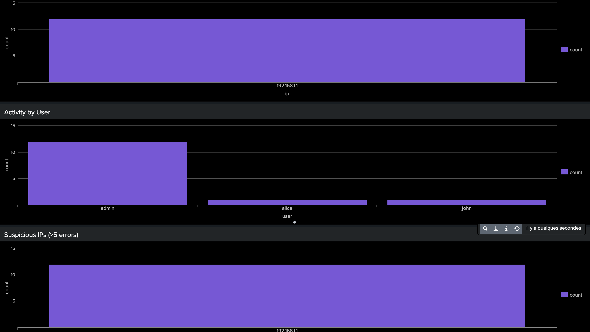
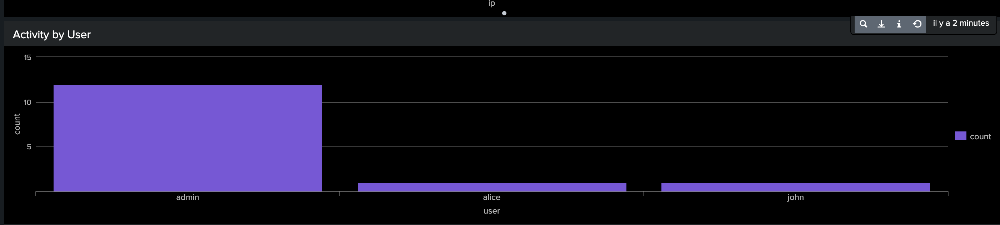
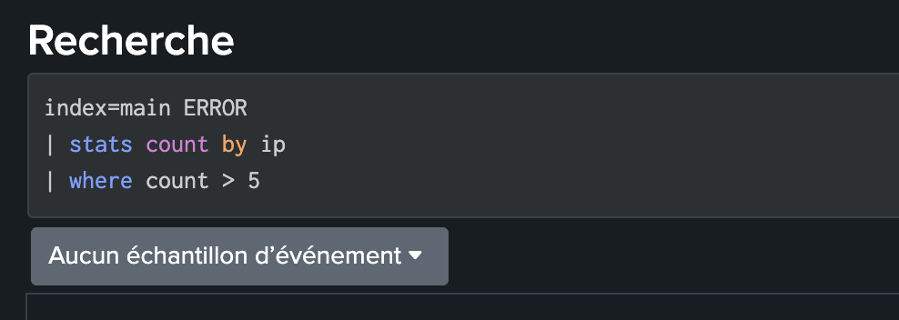

## 📊 Log Monitoring & Anomaly Detection (Splunk + ELK)

This project focuses on analyzing system and authentication logs to detect anomalous behaviors such as brute-force attacks.

---

### 🔍 Objectives

* Analyze log data (authentication, system logs)
* Detect anomalies (repeated failed login attempts)
* Identify suspicious IPs and targeted users
* Build monitoring dashboards

---

### 🧰 Tools

* Splunk (SPL, dashboards)
* Elastic Stack (Kibana)
* Python (optional)

---

### 🚨 Use Case

Detection of brute-force attacks through repeated failed login attempts on admin accounts.

---

### 📈 Key Features

* Aggregation of events by IP and user
* Time-based analysis (timechart)
* Detection rules (threshold-based anomalies)
* Visualization dashboards

---

### 📊 Example Detection Rule

```spl
index=main ERROR
| stats count by ip
| where count > 5
```

---

### 📁 Dataset

Synthetic logs simulating authentication events and attack scenarios.

---

### 📸 Screenshots

## 📸 Screenshots

### Dashboard


### Attacks by IP


### SPL Query

